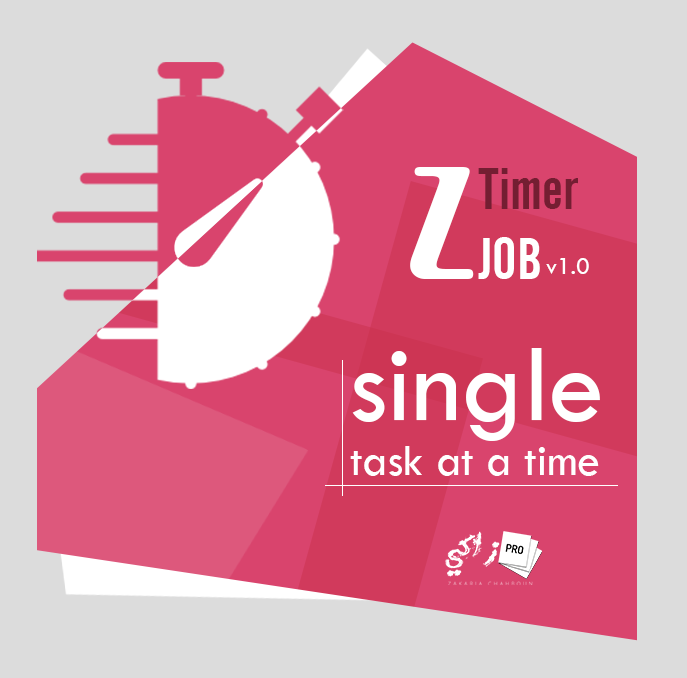
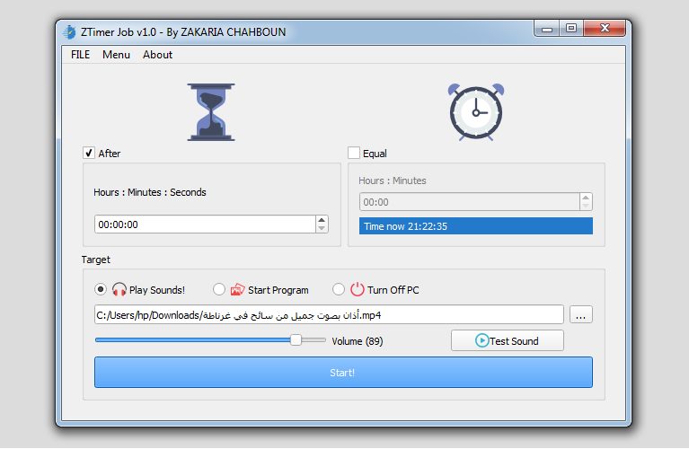
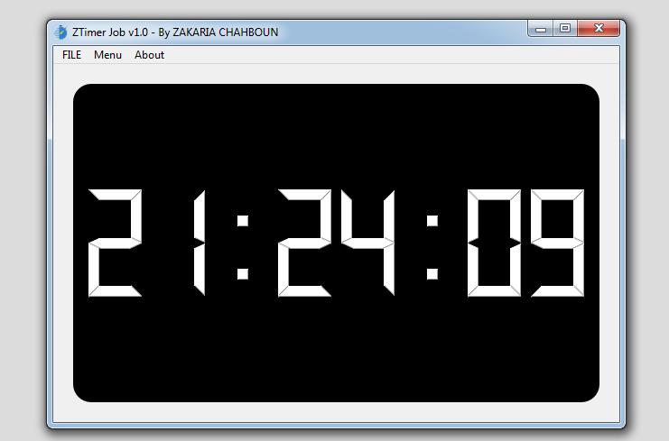
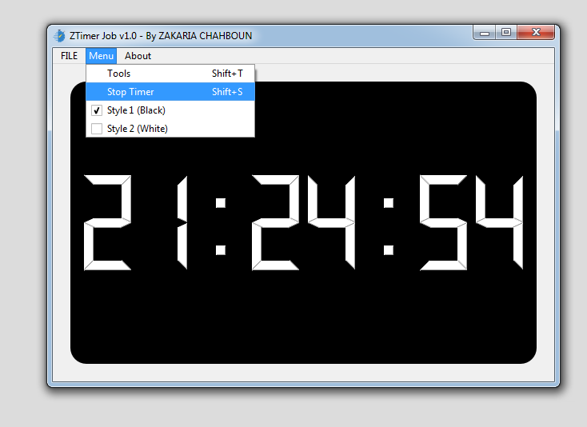
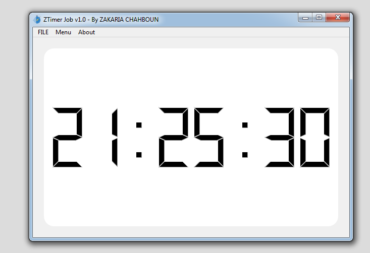

# ZTimerJob

###### ZAKARIA CHAHBOUN
###### 04/08/2018

---------------------------------------
With *`Z timer job`* you can do a ***single task***  at a specific time!

You can select two options : ***countdown***, or ***in a hour***.

This program can open *PDF, WORLD, VEDIO, AUDIO, APPLICATION ..* **Anything!**

Also you can ***Play a sound*** without native program and you can ***shutdown*** your pc!!

---------------------------------------

* Programming language : C++11
* Framework : Qt5

---------------------------------------

Screenshots:
* Splashscreen

* Application

* Timer

* Tools

* Black/White Style

Play Video! It's beautiful and easy to use ♥!
<video src="Screenshots/How to use.mp4" width="320" height="200" controls preload></video>

---------------------------
 <a href="https://twitter.com/Zaki_Chahboun">@Zaki_Chahboun</a>
 
 <a href="https://facebook.com/zakaria.chahboun.2018">Zakaria Chahboun</a>
 
 Zakaria.Chahboun.1996@Gmail.Com

